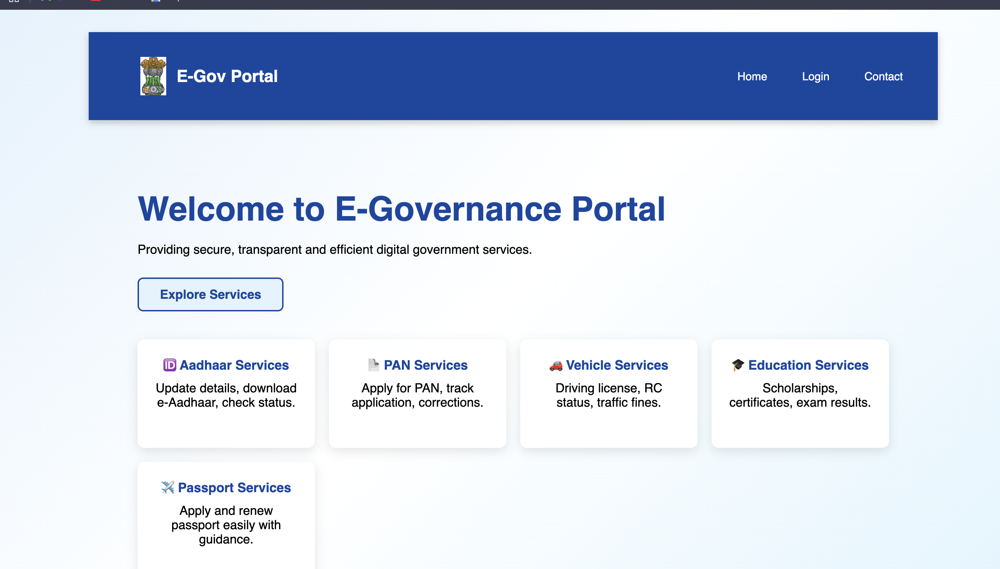
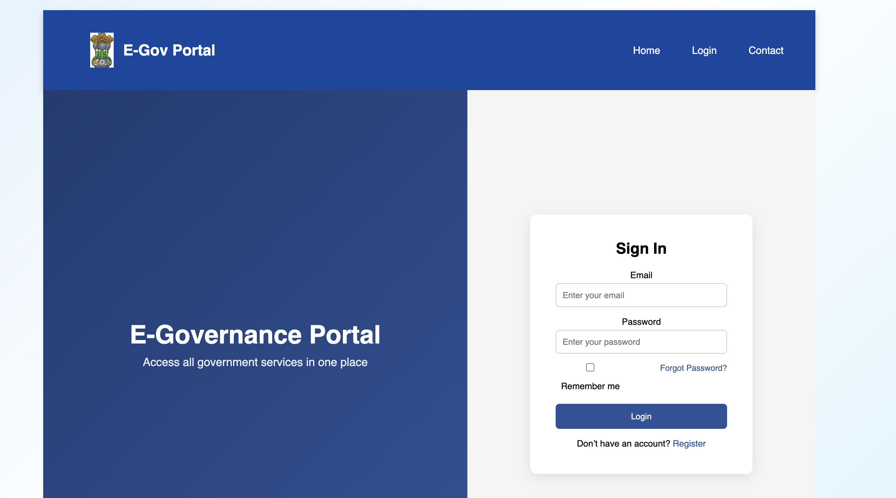
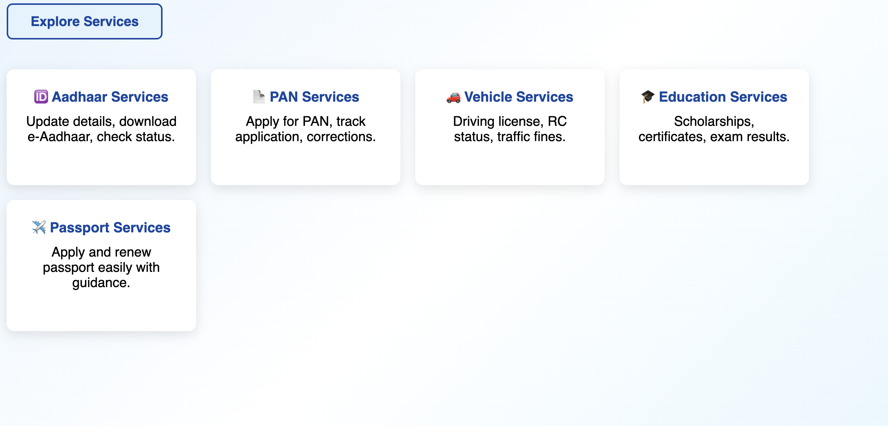

# 🏛️ E-Governance Portal

A modern full-stack E-Governance Portal that enables citizens to access government services digitally through a secure and user-friendly web application.

## ✨ Features

- Citizen Registration & Login
- Secure Authentication
- Online Government Services
- User Dashboard
- Responsive Design
- Fast and Modern UI
- Backend API Integration

## 🛠️ Tech Stack

### Frontend
- React.js
- Vite
- HTML5
- CSS3
- JavaScript

### Backend
- Node.js
- Express.js

### Database
- MongoDB

## 📸 Screenshots

### Home Page



### Login Page



### Citizen Dashboard


### Government Services



### Admin Dashboard


## 📂 Project Structure

```text
backend/
public/
src/
screenshots/
README.md
```

## 🚀 Installation

```bash
git clone https://github.com/yourusername/e-governance-portal.git

cd e-governance-portal

npm install

npm run dev
```

## 👨‍💻 Author

**Kabir Pandey**

B.Tech Computer Science & Engineering
